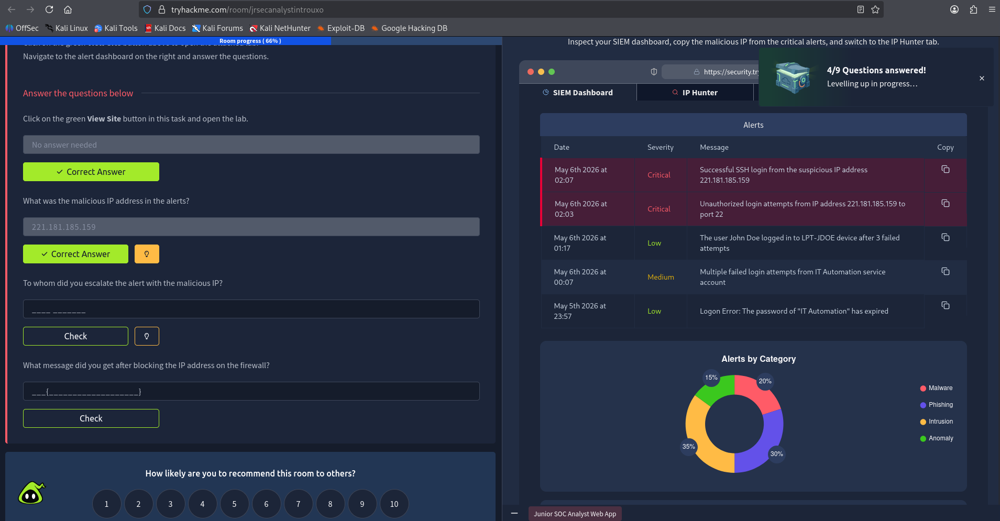
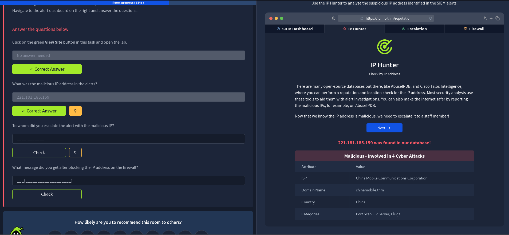
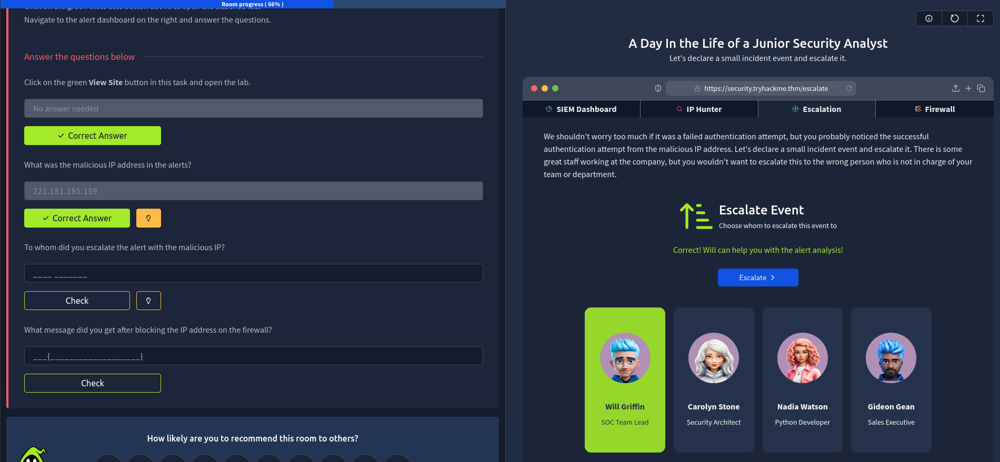
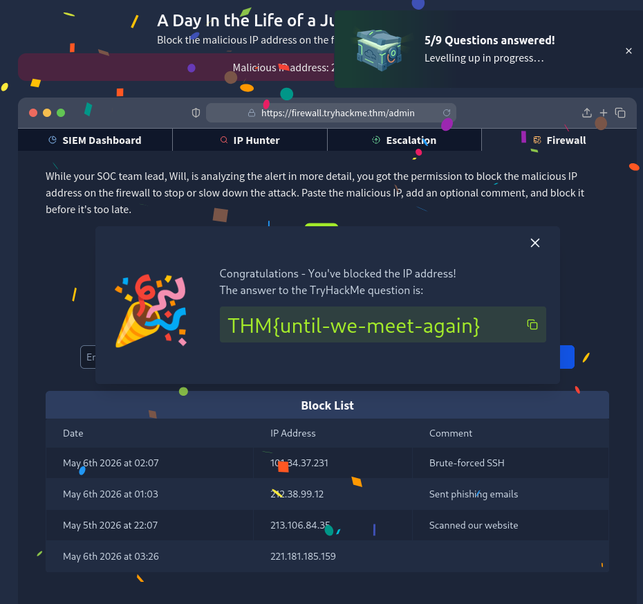

# Junior Security Analyst Walkthrough

Cybersecurity is not just about hacking systems or chasing malware signatures. In real-world environments, Security Analysts act as the first line of defense against ongoing attacks, suspicious behavior, phishing campaigns, and infrastructure abuse. In this walkthrough, we step into the role of a Junior Security Analyst and experience a simplified version of how a SOC operates daily. 

---

# Task 1 — Junior Security Analyst

The room starts by introducing the role of a Junior Security Analyst, often referred to as a Level 1 (L1) Analyst inside a Security Operations Center (SOC). The main responsibility here is monitoring alerts, identifying suspicious activity, escalating critical incidents, and helping defend the organization against threats.

A SOC team typically works 24/7 because attacks do not follow business hours. Analysts continuously monitor logs, SIEM dashboards, endpoint alerts, firewall events, and phishing reports.

### Question:

**Which team do you work with as a Junior Security Analyst?**

### Answer:

```text
SOC
```

---

# Task 2 — Security Operations Center (SOC)

This section introduces the different members inside a SOC environment and how they contribute to incident response and organizational defense.

Some important roles covered:

* **Senior Analysts** → Handle advanced investigations and assist junior analysts.
* **Security Engineers** → Configure detection systems and maintain security tooling.
* **Managers** → Coordinate operations and reporting.
* **Incident Responders** → Handle major security incidents like ransomware outbreaks.

Understanding these roles is important because cybersecurity is highly collaborative. Analysts rarely work alone during real incidents.

### Question:

**Continue to the next task!**

No answer needed.

---

# Task 3 — A Day in the Life of a Security Analyst

This is the practical portion of the room where we investigate alerts inside a SOC dashboard.

The goal was to review incoming alerts, identify malicious activity, escalate the issue appropriately, and finally contain the threat by blocking the attacker IP on the firewall.

---

# Step 1 — Investigating the Alert

Inside the alert dashboard, we reviewed the triggered security events and identified a suspicious external IP address involved in malicious activity.

This stage is important because analysts must validate whether activity is benign, suspicious, or outright malicious before escalating further.

### Malicious IP Identified

```text
221.181.185.159
```

The IP appeared in the security alerts as part of suspicious traffic indicators and required immediate attention.



---

# Step 2 — Escalating the Incident

After validating the malicious indicator, the next step was escalation.

In real SOC environments, escalation is extremely important because junior analysts usually perform initial triage, while senior analysts handle deeper forensic investigations and decision-making for critical threats.

The alert was escalated to the Senior Analyst mentioned in the SOC team.

### Escalated To

```text
Will Griffin
```





---

# Step 3 — Blocking the Malicious IP

After escalation, the final action involved blocking the attacker IP through the firewall.

Blocking malicious IPs is a common containment technique used to prevent further communication between attackers and internal infrastructure. While it does not completely eliminate a threat actor, it significantly reduces active exploitation attempts and malicious traffic reaching the network.

### Action Performed

```text
Blocked malicious IP on firewall
```

Once the block was applied successfully, the lab returned the following flag:

### Flag



---

# Key Takeaways

This room provides a beginner-friendly introduction to how SOC operations function in real-world environments. Even though the tasks are simplified, the workflow mirrors actual analyst responsibilities:

* Monitoring alerts
* Investigating suspicious indicators
* Escalating incidents
* Applying containment actions
* Working collaboratively inside a SOC

One important takeaway is that cybersecurity defense is heavily process-driven. Even small actions like validating an IP address or escalating a ticket properly can prevent larger incidents from impacting an organization.

For beginners entering blue teaming or SOC analysis, this room offers a solid introduction to incident handling workflows and defensive operations.
